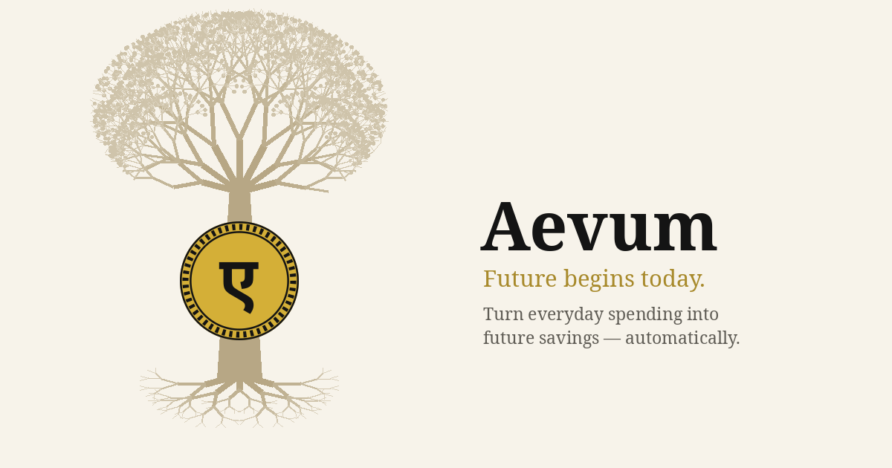

<!--
  ORG PROFILE README — LIVE at github.com/Aevum-Finance (renders from profile/README.md).
  Now edited from the local clone at Aevum/.github; commit + push to main to publish.

  Image paths are RELATIVE (banners sit next to this README in profile/). If they ever fail
  to render on the org page, swap each src/srcset for the absolute raw URL:
    https://raw.githubusercontent.com/Aevum-Finance/.github/main/profile/product-banner-dark.png

  The lead paragraph mirrors branding.json `description` (the meaning-led sales pitch); "How it
  works" carries the mechanism. Keep it why-then-how, in sync with the app's brand copy.

  Guardrails honoured: currency-neutral, no "Founder" (role = Creator & Architect), no
  commercial/monetization framing, no hint of any future-selves / committee mechanism.
-->

  <picture>
    <source media="(prefers-color-scheme: dark)"  srcset="product-banner-dark.png">
    <source media="(prefers-color-scheme: light)" srcset="product-banner-cream.png">
    
  </picture>

<h3 align="center">Turn everyday spending into future savings — automatically.</h3>

<em>Future begins today.</em>

---

**Aevum** means an age — time that endures and accrues rather than runs out. Wealth is meant
to grow the same way: gently, one ordinary step at a time. Most money apps run on pressure —
budgets, streaks, the guilt when you slip; Aevum runs on a gentler idea. It turns everyday
spending into savings through one small nudge you set yourself — a quiet push in the right
direction that never becomes a shove. No pressure, no shame, no discipline required — just a
calmer path to real wealth that grows while you live your life.

### The idea

Here's the whole idea, plainly — and why it isn't what it sounds like.

Most of what leaves your account leaves by habit: small, forgettable expenses that never quite
turn into savings. Aevum changes that without asking you to budget harder or spend less. Every
time you record an expense, it adds a small self-imposed "tax" on top — at a rate you choose,
category by category — and moves that amount into a savings account you own. It isn't a fee and
it isn't lost. It's your money, set aside for you, building a provision for the next expense of
the same kind: spend on dining today and you're quietly funding future dining; spend on travel,
future travel.

Set a budget on the things that matter, and going over adds a little more — not a punishment,
just a sharper nudge you asked for. You stay in control the whole way: you set every rate, you
can change or pause them anytime, and you can see exactly where each unit went.

Around that core, Aevum does the quiet work of a good assistant — categorizing your
transactions, reading your statements, forecasting the recurring bills you tend to forget, and
turning it all into clear analytics, while a weekly ledger tallies what you've set aside. No
lectures, no alarms, no shame for spending. Just a steady, private habit that turns today's
ordinary purchases into tomorrow's security.

### How it works

- **Spend → self-tax → set aside.** A small consumption tax on qualifying spend moves into a
  dedicated savings account — a *provision*, not a punishment. You're pre-funding the next
  version of that same expense.
- **Budgets that hold.** Set limits on what matters; overspending adds a marginal nudge — a
  sharper reminder you chose, never a penalty imposed on you.
- **The unglamorous work, automated.** Auto-categorization, statement import, recurring-bill
  forecasting, and a weekly ledger that quietly grows your savings.

### Explore

- 📖 **Case study** — [rohitsolanki.in/aevum](https://rohitsolanki.in/aevum)
- 🧩 **Source** — the repositories below

Created &amp; architected by <a href="https://rohitsolanki.in">Rohit Solanki</a>.
